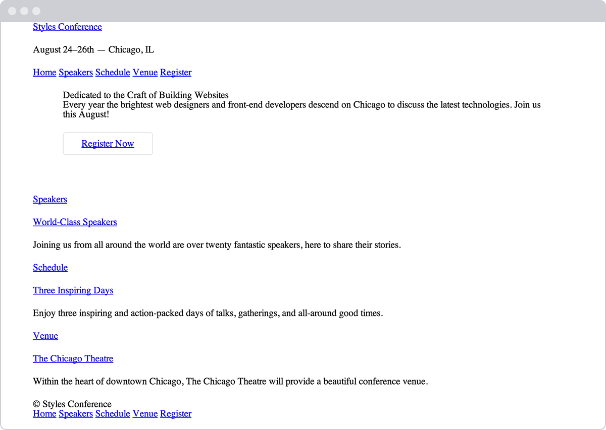

Let’s jump back into our Styles Conference website to center it on the page and
add some more content.

## Step 1

Let’s start by adjusting our box size to use the border-box version of the box
model, which will make sizing all of our elements much easier. Within our
main.css file, just below our reset, let’s add a comment to identify the code
for what will become our grid and help determine the layout of our website.
We’re putting this below our reset so that it falls in the proper position
within the cascade.

From there, we can use the universal selector, _, along with universal
pseudo-elements, _:before and \*:after, to select every imaginable element and
change the box-sizing to border-box. Remember, we’re going to want to include
the necessary vendor prefixes for the box-sizing property, as it is a relatively
new property.

```css
/*
  ========================================
  Grid
  ========================================
*/

*,
*:before,
*:after {
	-webkit-box-sizing: border-box;
	-moz-box-sizing: border-box;
	box-sizing: border-box;
}
```

## Step 2

Next we’ll want to create a class that will serve as a container for our
elements. We can use this container class on different elements to set a common
width, center the elements on the page, and apply some common horizontal
padding.

Just below our universal selector rule set, let’s create a selector with a class
of container. Within this selector let’s set our width to 960 pixels, our left
and right padding to 30 pixels, our top and bottom margins to 0, and our left
and right margins to auto.

Setting a width tells the browser definitively how wide any element with the
class of container should be. Using a left and right margin of auto in
conjunction with this width lets the browser automatically figure out equal left
and right margins for the element, thus centering it on the page. Lastly, the
left and right padding ensures that our content isn’t sitting directly on the
edge of the element and provides a little breathing room for the content.

```css
.container {
	margin: 0 auto;
	padding-left: 30px;
	padding-right: 30px;
	width: 960px;
}
```

## Step 3

Now that we have a container class available to use, let’s go ahead and apply
the class of container throughout our HTML to the `<header>` and `<footer>`
elements on each page, including the index.html, speakers.html, schedule.html,
venue.html, and register.html files.

```html
<header class="container">...</header>

<footer class="container">...</footer>
```

## Step 4

While we’re at it, let’s go ahead and center the rest of the content on our
pages. On the home page, our index.html file, let’s add the class of container
to each `<section>` element on the page, one for our hero section (the section
that introduces our conference) and one for our teasers section.

```html
<section class="container">...</section>
```

Additionally, let’s wrap all of the `<h1>` elements on each page with a
`<section>` element with the class of container.

```html
<section class="container">
	<h1>...</h1>
</section>
```

We’ll come back and adjust these elements and classes later, but for now we’re
headed in the right direction.

## Step 5

Now that all of our content is centered, let’s create some vertical spacing
between elements. For starters let’s place a 22-pixel bottom margin on a few of
our heading and paragraph elements. We’ll place and comment on these typography
styles below our grid styles.

```css
/*
  ========================================
  Typography
  ========================================
*/

h1,
h3,
h4,
h5,
p {
	margin-bottom: 22px;
}
```

We intentionally skipped `<h2>` and `<h6>` elements, as the design does not call
for margins on `<h2>` elements and as we won’t be using any `<h6>` elements at
this time.

## Step 6

Let’s also try our hand at creating a border and some rounded corners. We’ll
start by placing a button within the top `<section>` element on our home page,
just below the header.

Previously we added an `<a>` element within this `<section>` element. Let’s add
the classes of btn and btn-alt to this anchor.

```html
<a class="btn btn-alt">...</a>
```

Now let’s create some styles for those classes within our CSS. Below our
typography rule set, let’s create a new section of the CSS file for buttons.

To begin let’s add the btn class and apply some common styles that can be shared
across all buttons. We’ll want all of our buttons to have a 5-pixel
border-radius. They should be displayed as inline-block elements so we can add
padding around all four sides without issue; we’ll remove any margin.

```css
/*
  ========================================
  Buttons
  ========================================
*/

.btn {
	border-radius: 5px;
	display: inline-block;
	margin: 0;
}
```

We’ll also want to include styles specific to this button, which we’ll do by
using the btn-alt class. Here we’ll add a 1-pixel, solid, gray border with 10
pixels of padding on the top and bottom of the button and 30 pixels of padding
on the left and right of the button.

```css
.btn-alt {
	border: 1px solid #dfe2e5;
	padding: 10px 30px;
}
```

Using both the btn and btn-alt classes on the same `<a>` element allows these
styles to be layered on, rendering all of the styles on a single element.

## Step 7

Because we’re working on the home page, let’s also add a bit of padding to the
`<section>` element that contains our `<a>` element with the classes of btn and
btn-alt. We’ll do so by adding a class attribute value of hero to the
`<section>` element, alongside the container class attribute value, as this will
be the leading section of our website.

```html
<section class="hero container">...</section>
```

Next we’ll want to create a new section within our CSS file for home page
styles, and, once we’re ready, we’ll use the class of hero to apply padding
around all four sides of the `<section>` element.

```css
/*
  ========================================
  Home
  ========================================
*/

.hero {
	padding: 22px 80px 66px 80px;
}
```

Our website is starting to come together, especially the home page.



<div style="border: 1px solid #cecfd5; border-radius: 5px; padding: 0px 20px">
    <h4>The Universal Selector</h4>
    <p>In the first step of this exercise we were introduced to the universal selector. In CSS the asterisk, *, is the universal selector, which selects every element. Rather than listing every single element imaginable, we can use the asterisk as a catch-all to select all elements for us.</p>
    <p>The :before and :after pseudo-elements also mentioned in this step are elements that can be dynamically generated with CSS. We’re not going to be using these elements within our project; however, when using the universal selector it’s a good practice to also include these pseudo-elements in case they should ever appear.</p>
</div>

## Summary

Take a second and pat yourself on the back. I’ll wait.

Learning all the different parts of the box model is no small feat. These
concepts, although briefly introduced, take quite a bit of time to fully master,
and we’re on the right path toward doing so.

In brief, within this lesson we talked about the following:

-   How different elements are displayed
-   What the box model is and why it’s important
-   How to change the size, including the height and width, of elements
-   How to add margin, padding, and borders to elements
-   How to change the box sizing of elements and the effects this has on the box
    model

Now that we have a better understanding of how elements are displayed and sized,
it’s time to move into positioning these elements.
