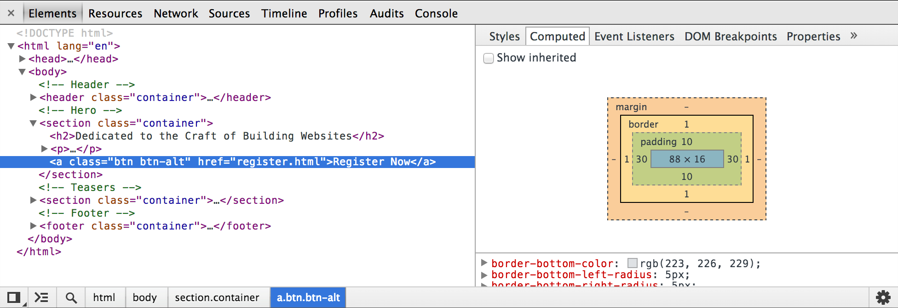

# Box Model

## Table of Contents

| No. | Topic                           |
| :-: | ------------------------------- |
|  1  | [How Are Elements Displayed?]() |
|  2  | []()                            |
|  3  | []()                            |

We’ve familiarized ourselves with HTML and CSS; we know what they look like and
how to accomplish some of the basics. Now we’re going to go a bit deeper and
look at exactly how elements are displayed on a page and how they are sized.

In the process we’ll discuss what is known as the box model and how it works
with HTML and CSS. We’re also going to look at a few new CSS properties and use
some of the length values we covered in Lesson 3. Let’s begin.

## How Are Elements Displayed?

Before jumping into the box model, it helps to understand how elements are
displayed. In Lesson 2 we covered the difference between block-level and
inline-level elements. To quickly recap, block-level elements occupy any
available width, regardless of their content, and begin on a new line.
Inline-level elements occupy only the width their content requires and line up
on the same line, one after the other. Block-level elements are generally used
for larger pieces of content, such as headings and structural elements.
Inline-level elements are generally used for smaller pieces of content, such as
a few words selected to be bold or italicized.

### Display

Exactly how elements are displayed—as block-level elements, inline elements, or
something else—is determined by the display property. Every element has a
default display property value; however, as with all other property values, that
value may be overwritten. There are quite a few values for the display property,
but the most common are block, inline, inline-block, and none.

We can change an element’s display property value by selecting that element
within CSS and declaring a new display property value. A value of block will
make that element a block-level element.

```css
p {
	display: block;
}
```

A value of inline will make that element an inline-level element.

```css
p {
	display: inline;
}
```

Things get interesting with the inline-block value. Using this value will allow
an element to behave as a block-level element, accepting all box model
properties (which we’ll cover soon). However, the element will be displayed in
line with other elements, and it will not begin on a new line by default.

```css
p {
	display: inline-block;
}
```

<div style="border: 1px solid #cecfd5; border-radius: 5px; padding: 0px 20px">
    <h4>The Space Between Inline-Block Elements</h4>
    <p>One important distinction with inline-block elements is that they are not always touching, or displayed directly against one another. Usually a small space will exist between two inline-block elements. This space, though perhaps annoying, is normal. We’ll discuss why this space exists and how to remove it in the next lesson.</p>
</div>

Lastly, using a value of none will completely hide an element and render the
page as if that element doesn’t exist. Any elements nested within this element
will also be hidden.

```css
div {
	display: none;
}
```

Knowing how elements are displayed and how to change their display is fairly
important, as the display of an element has implications on how the box model is
rendered. As we discuss the box model, we’ll be sure to look at these different
implications and how they can affect the presentation of an element.

## What Is the Box Model?

According to the box model concept, every element on a page is a rectangular box
and may have width, height, padding, borders, and margins.

That’s worth repeating: Every element on a page is a rectangular box.

<!-- put some example images -->

Every element on every page conforms to the box model, so it’s incredibly
important. Let’s take a look at it, along with a few new CSS properties, to
better understand what we are working with.

## Working with the Box Model

Every element is a rectangular box, and there are several properties that
determine the size of that box. The core of the box is defined by the width and
height of an element, which may be determined by the display property, by the
contents of the element, or by specified width and height properties. padding
and then border expand the dimensions of the box outward from the element’s
width and height. Lastly, any margin we have specified will follow the border.

Each part of the box model corresponds to a CSS property: width, height,
padding, border, and margin.

Let’s look these properties inside some code:

```css
div {
	border: 6px solid #949599;
	height: 100px;
	margin: 20px;
	padding: 20px;
	width: 400px;
}
```

According to the box model, the total width of an element can be calculated
using the following formula:

```
margin-right + border-right + padding-right + width + padding-left + border-left + margin-left
```

In comparison, according to the box model, the total height of an element can be
calculated using the following formula:

```
margin-top + border-top + padding-top + height + padding-bottom + border-bottom + margin-bottom
```


Using the formulas, we can find the total height and width of our example code.

-   Width: `492px` = `20px` + `6px` + `20px` + `400px` + `20px` + `6px` + `20px`
-   Height: `192px` = `20px` + `6px` + `20px` + `100px` + `20px` + `6px` +
    `20px`

The box model is without question one of the more confusing parts of HTML and
CSS. We set a width property value of 400 pixels, but the actual width of our
element is 492 pixels. By default the box model is additive; thus to determine
the actual size of a box we need to take into account padding, borders, and
margins for all four sides of the box. Our width not only includes the width
property value, but also the size of the left and right padding, left and right
borders, and left and right margins.

So far a lot of these properties might not make a whole lot of sense, and that’s
all right. To clarify things, let’s take a close look at all of the
properties—width, height, padding, border, and margin—that go into forming the
box model.

### Width & Height

Every element has default width and height. That width and height may be 0
pixels, but browsers, by default, will render every element with size. Depending
on how an element is displayed, the default width and height may be adequate. If
an element is key to the layout of a page, it may require specified width and
height property values. In this case, the property values for non-inline
elements may be specified.

#### Width

The default width of an element depends on its display value. Block-level
elements have a default width of 100%, consuming the entire horizontal space
available. Inline and inline-block elements expand and contract horizontally to
accommodate their content. Inline-level elements cannot have a fixed size, thus
the width and height properties are only relevant to non-inline elements. To set
a specific width for a non-inline element, use the width property:

```css
div {
	width: 400px;
}
```

#### Height

The default height of an element is determined by its content. An element will
expand and contract vertically as necessary to accommodate its content. To set a
specific height for a non-inline element, use the height property:

```css
div {
	height: 100px;
}
```

<div style="border: 1px solid #cecfd5; border-radius: 5px; padding: 0px 20px">
    <h4>Sizing Inline-Level Elements</h4>
    <p>Please keep in mind that inline-level elements will not accept the width and height properties or any values tied to them. Block and inline-block elements will, however, accept the width and height properties and their corresponding values.</p>
</div>

### Margin & Padding

Depending on the element, browsers may apply default margins and padding to an
element to help with legibility and clarity. We will generally see this with
text-based elements. The default margins and padding for these elements may
differ from browser to browser and element to element. In Lesson 1 we discussed
using a CSS reset to tone all of these default values down to zero. Doing so
allows us to work from the ground up and to specify our own values.

#### Margin

The margin property allows us to set the amount of space that surrounds an
element. Margins for an element fall outside of any border and are completely
transparent in color. Margins can be used to help position elements in a
particular place on a page or to provide breathing room, keeping all other
elements a safe distance away. Here’s the margin property in action:

```css
div {
	margin: 20px;
}
```

One oddity with the margin property is that vertical margins, top and bottom,
are not accepted by inline-level elements. These vertical margins are, however,
accepted by block-level and inline-block elements.

#### Padding

The padding property is very similar to the margin property; however, it falls
inside of an element’s border, should an element have a border. The padding
property is used to provide spacing directly within an element. Here’s the code:

```css
div {
	padding: 20px;
}
```

The padding property, unlike the margin property, works vertically on
inline-level elements. This vertical padding may blend into the line above or
below the given element, but it will be displayed.

<div style="border: 1px solid #cecfd5; border-radius: 5px; padding: 0px 20px">
    <h4>Margin & Padding on Inline-Level Elements</h4>
    <p>Inline-level elements are affected a bit differently than block and inline-block elements when it comes to margins and padding. Margins only work horizontally—left and right—on inline-level elements. Padding works on all four sides of inline-level elements; however, the vertical padding—the top and bottom—may bleed into the lines above and below an element.</p>
    <p>Margins and padding work like normal for block and inline-block elements.</p>
</div>

#### Margin & Padding Declarations

In CSS, there is more than one way to declare values for certain properties. We
can use longhand, listing multiple properties and values one after the other, in
which each value has its own property. Or we can use shorthand, listing multiple
values with one property. Not all properties have a shorthand alternative, so we
must make sure we are using the correct property and value structure.

The margin and padding properties come in both longhand and shorthand form. When
using the shorthand margin property to set the same value for all four sides of
an element, we specify one value:

```css
div {
	margin: 20px;
}
```

To set one value for the top and bottom and another value for the left and right
sides of an element, specify two values: top and bottom first, then left and
right. Here we are placing margins of 10 pixels on the top and bottom of a
`<div>` and margins of 20 pixels on the left and right:

```css
div {
	margin: 10px 20px;
}
```

To set unique values for all four sides of an element, specify those values in
the order of top, right, bottom, and left, moving clockwise. Here we are placing
margins of 10 pixels on the top of a `<div>`, 20 pixels on the right, 0 pixels
on the bottom, and 15 pixels on the left.

```css
div {
	margin: 10px 20px 0 15px;
}
```

Using the margin or padding property alone, with any number of values, is
considered shorthand. With longhand, we can set the value for one side at a time
using unique properties. Each property name (in this case margin or padding) is
followed by a dash and the side of the box to which the value is to be applied:
top, right, bottom, or left. For example, the padding-left property accepts only
one value and will set the left padding for that element; the margin-top
property accepts only one value and will set the top margin for that element.

```css
div {
	margin-top: 10px;
	padding-left: 6px;
}
```

When we wish to identify only one margin or padding value, it is best to use the
longhand properties. Doing so keeps our code explicit and helps us to avoid any
confusion down the road. For example, did we really want to set the top, right,
and left sides of the element to have margins of 0 pixels, or did we really only
want to set the bottom margin to 10 pixels? Using longhand properties and values
here helps to make our intentions clear. When dealing with three or more values,
though, shorthand is incredibly helpful.

<div style="border: 1px solid #cecfd5; border-radius: 5px; padding: 0px 20px">
    <h4>Margin & Padding Colors</h4>
    <p>
        The margin and padding properties are completely transparent and do not accept any color values. Being transparent, though, they show the background colors of relative elements. For margins, we see the background color of the parent element, and for padding, we see the background color of the element the padding is applied to.
    </p>
</div>

### Borders

Borders fall between the padding and margin, providing an outline around an
element. The border property requires three values: width, style, and color.
Shorthand values for the border property are stated in that order—width, style,
color. In longhand, these three values can be broken up into the border-width,
border-style, and border-color properties. These longhand properties are useful
for changing, or overwriting, a single border value.

The width and color of borders can be defined using common CSS units of length
and color, as discussed in Lesson 3.

Borders can have different appearances. The most common style values are solid,
double, dashed, dotted, and none, but there are several others to choose from.

Here is the code for a 6-pixel-wide, solid, gray border that wraps around all
four sides of a `<div>`:

```css
div {
	border: 6px solid #949599;
}
```

#### Individual Border Sides

As with the margin and padding properties, borders can be placed on one side of
an element at a time if we’d like. Doing so requires new properties: border-top,
border-right, border-bottom, and border-left. The values for these properties
are the same as those of the border property alone: width, style, and color. If
we want, we can make a border appear only on the bottom of an element:

```css
div {
	border-bottom: 6px solid #949599;
}
```

Additionally, styles for individual border sides may be controlled at an even
finer level. For example, if we wish to change only the width of the bottom
border we can use the following code:

```css
div {
	border-bottom-width: 12px;
}
```

These highly specific longhand border properties include a series of
hyphen-separated words starting with the border base, followed by the selected
side—top, right, bottom, or left—and then width, style, or color, depending on
the desired property.

### Border Radius

While we’re looking at borders and their different properties, we need to
examine the border-radius property, which enables us to round the corners of an
element.

The border-radius property accepts length units, including percentages and
pixels, that identify the radius by which the corners of an element are to be
rounded. A single value will round all four corners of an element equally; two
values will round the top-left/bottom-right and top-right/bottom-left corners in
that order; four values will round the top-left, top-right, bottom-right, and
bottom-left corners in that order.

When considering the order in which multiple values are applied to the
border-radius property (as well as the margin and padding properties), remember
that they move in a clockwise fashion starting at the top left of an element.

```css
div {
	border-radius: 5px;
}
```

The border-radius property may also be broken out into longhand properties that
allow us to change the radii of individual corners of an element. These longhand
properties begin with border, continue with the corner’s vertical location (top
or bottom) and the corner’s horizontal location (left or right), and then end
with radius. For example, to change the top-right corner radius of a <div>, the
border-top-right-radius property can be used.

```css
div {
	border-top-right-radius: 5px;
}
```

### Box Sizing

Until now the box model has been an additive design. If you set the width of an
element to 400 pixels and then add 20 pixels of padding and a border of 10
pixels on every side, the actual full width of the element becomes 460 pixels.
Remember, we need to add the width, padding, and border property values together
to get the actual, full width of an element.

The box model may, however, be changed to support different calculations. CSS3
introduced the box-sizing property, which allows us to change exactly how the
box model works and how an element’s size is calculated. The property accepts
three primary values—content-box, padding-box, and border-box—each of which has
a slightly different impact on how the box size is calculated.

#### Content Box

The content-box value is the default value, leaving the box model as an additive
design. If we don’t use the box-sizing property, this will be the default value
for all elements. The size of an element begins with the width and height
properties, and then any padding, border, or margin property values are added on
from there.

```css
div {
	-webkit-box-sizing: content-box;
	-moz-box-sizing: content-box;
	box-sizing: content-box;
}
```

<div style="border: 1px solid #cecfd5; border-radius: 5px; padding: 0px 20px">
    <h4>Browser-Specific Properties & Values </h4>
    <p>What are all those hyphens and letters on the box-sizing property?</p>
    <p>
        As CSS3 was introduced, browsers gradually began to support different properties
        and values, including the box-sizing property, by way of vendor prefixes. As
        parts of the CSS3 specification are finalized and new browser versions are
        released, these vendor prefixes become less and less relevant. As time goes on,
        vendor prefixes are unlikely to be a problem; however, they still provide
        support for some of the older browsers that leveraged them. We may run across
        them from time to time, and we may even want to use them should we wish to
        support older browsers.
    </p>  
    <p>
        Vendor prefixes may be seen on both properties and values, all depending on the
        CSS specification. Here they are shown on the box-sizing property. Browser
        vendors were free to chose when to use a prefix and when not to. Thus, some
        properties and values require vendor prefixes for certain browser vendors but
        not for others.
    </p> 
    <p>
        Moving forward, when a property or value needs a vendor prefix, the prefix will
        only be used in the introduction of that property or value (in the interest of
        keeping our code digestible and concise). Do not forget to add the necessary
        vendor prefixes when you’re actually writing the code.
    </p>  
    <p>For reference, the most common vendor prefixes are outlined here:</p>
    <ul>
        <li>Mozilla Firefox: -moz- </li>
        <li>Microsoft Internet Explorer: -ms- </li>
        <li>Webkit (Google Chrome and Apple Safari): -webkit-</li>
    </ul>
</div>

#### Padding Box

The padding-box value alters the box model by including any padding property
values within the width and height of an element. When using the padding-box
value, if an element has a width of 400 pixels and a padding of 20 pixels around
every side, the actual width will remain 400 pixels. As any padding values
increase, the content size within an element shrinks proportionately.

If we add a border or margin, those values will be added to the width or height
properties to calculate the full box size. For example, if we add a border of 10
pixels and a padding of 20 pixels around every side of the element with a width
of 400 pixels, the actual full width will become 420 pixels.

```css
div {
	box-sizing: padding-box;
}
```

<div style="border: 1px solid #cecfd5; border-radius: 5px; padding: 0px 20px">
    <h4>The padding-box Value Has Been Deprecated</h4>
    <p>As the CSS specification has evolved, the padding-box value for the box-sizing property has been deprecated and should not be used.</p>
</div>

#### Border Box

Lastly, the border-box value alters the box model so that any border or padding
property values are included within the width and height of an element. When
using the border-box value, if an element has a width of 400 pixels, a padding
of 20 pixels around every side, and a border of 10 pixels around every side, the
actual width will remain 400 pixels.

If we add a margin, those values will need to be added to calculate the full box
size. No matter which box-sizing property value is used, any margin values will
need to be added to calculate the full size of the element.

```css
div {
	box-sizing: border-box;
}
```

CSS3 Box Sizing 

#### Picking a Box Size

Generally speaking, the best box-sizing value to use is border-box. The
border-box value makes our math much, much easier. If we want an element to be
400 pixels wide, it is, and it will remain 400 pixels wide no matter what
padding or border values we add to it.

Additionally, we can easily mix length values. Say we want our box to be 40%
wide. Adding a padding of 20 pixels and a border of 10 pixels around every side
of an element isn’t difficult, and we can still guarantee that the actual width
of our box will remain 40% despite using pixel values elsewhere.

The only drawback to using the box-sizing property is that as part of the CSS3
specification, it isn’t supported in every browser; it especially lacks support
in older browsers. Fortunately this is becoming less and less relevant as new
browsers are released. Chances are we’re safe to use the box-sizing property,
but should we notice any issues, it’s worth looking into which browser those
issues are occurring with.

## Developer Tools

Most browsers have what are known as Developer Tools. These tools allow us to
inspect an element on a page, see where that element lives within the HTML
document, and see what CSS properties and values are being applied to it. Most
of these tools also include a box model diagram to show the computed size of an
element.

To see the Developer Tools in Google Chrome, click “View” within the menu bar
and navigate to “Developer” and then “Developer Tools.” This loads a drawer at
the bottom of the browser window that provides a handful of tools for inspecting
our code.

Clicking the magnifying glass at the bottom of this drawer enables us to hover
over and then click on different elements on the page to review more information
about them.

After selecting an element, we’ll see a handful of tabs on the right-hand side
of the Elements panel within our Developer Tools. Selecting the “Computed” tab
will show us a breakdown of the box model for our selected element.

Play around with the Developer Tools, be it in Google Chrome, Mozilla Firefox,
Apple Safari, or other browsers; there is much to learn from looking at our
code. I generally leave the Developer Tools open at all times when writing HTML
and CSS. And I frequently inspect the code of other websites to see how they are
built, too.



The box model is one of the most confusing parts of learning how to write HTML
and CSS. It is also one of the most powerful parts of HTML and CSS, and once we
have it mastered, most everything else—like positioning content—will come to us
fairly easily.
