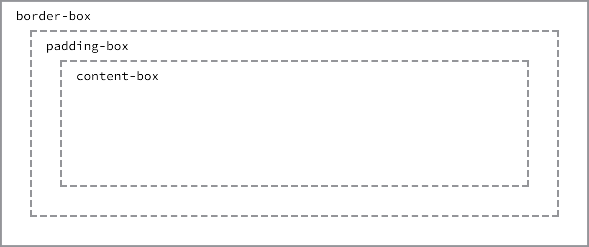

# Box Model

## Table of Contents

| No. | Topic                                                     |
| :-: | --------------------------------------------------------- |
|  1  | [How Are Elements Displayed](#how-are-elements-displayed) |
|  2  | [The Box Model](#the-box-model)                           |
|  3  | [Working With the Box Model](#working-with-the-box-model) |
|  4  | [Developer Tools](#developer-tools)                       |

<br/>
We’re going to go a bit deeper and look at exactly how elements are displayed on a page and how they are sized.

<br/> <br/>

## How Are Elements Displayed

### Display

Most common values for `display` property are `block`, `inline`, `inline-block`, and `none`. If you are not familiar with inline/block elements - we have covered that in [02-HTML-Introduction](../02-HTML-Introduction/notes.md/#block-vs-inline-elements).

A value of `block` will make that element a block-level element.

```css
p {
  display: block;
}
```

A value of `inline` will make that element an inline-level element.

```css
p {
  display: inline;
}
```

`inline-block` value will allow an element to behave as a block-level element while displayed in
line with other elements, and it will not begin on a new line by default.

```css
p {
  display: inline-block;
}
```

`none` value will completely hide an element:

```css
div {
  display: none;
}
```

<br/><br/>

## The Box Model

According to the box model concept, every element on a page is a rectangular box and may have `width`, `height`, `padding`, `borders`, and `margins`:


## Working with the Box Model

Let’s look these properties inside the following code:

```css
div {
  border: 6px solid #949599;
  height: 100px;
  margin: 20px;
  padding: 20px;
  width: 400px;
}
```


The total height and width of our example code is calculated as such:

- Width: `492px` = `20px` + `6px` + `20px` + `400px` + `20px` + `6px` + `20px`
- Height: `192px` = `20px` + `6px` + `20px` + `100px` + `20px` + `6px` +
  `20px`

> The box model is without question one of the more confusing parts of HTML and CSS. We set a width property value of 400 pixels, but the actual width of our element is 492 pixels. By default the box model is additive; thus to determine the actual size of a box we need to take into account padding, borders, and margins for all four sides of the box.

<br/>

### Width & Height

#### Width

To set a specific width for an element, use the `width` property:

```css
div {
  width: 400px;
}
```

#### Height

To set a specific height for an element, use the `height` property:

```css
div {
  height: 100px;
}
```

<br/>

### Margin & Padding

> Depending on the element, browsers may apply default margins and padding to an element to help with legibility and clarity. The default margins and padding for these elements may differ from browser to browser and element to element. Hence it is generally a good practice in CSS to reset all of these default values down to zero. Doing so allows us to work from the ground up and to specify our own values.

#### Margin

`Margin` property allows us to set the amount of space that surrounds an element.

```css
div {
  /* all sides equal margin of 20px */
  margin: 20px;
}

div {
  /* the sides can also be declared separately */
  margin-top: 20px;
  margin-bottom: 20px;
  margin-left: 20px;
  margin-right: 20px;
}
```

#### Padding

The `padding` property is very similar to the `margin` property; however, it falls inside of an element’s border

```css
div {
  /* all sides equal padding of 20px */
  padding: 20px;
}

div {
  /* the sides can also be declared separately */
  padding-top: 20px;
  padding-right: 20px;
  padding-bottom: 20px;
  padding-left: 20px;
}
```

<br/>

### Borders

Borders fall between the `padding` and `margin`, providing an outline around an element. The `border` property requires three values: `width`, `style`, and `color`.

Borders can have different appearances. The most common style values are `solid`, `double`, `dashed`, `dotted`, and `none`.

```css
div {
  border: 6px solid gray;
}

/* or can be declared separately as */

div {
  border-width: 6px;
  border-style: solid;
  border-color: gray;
}
```

#### Individual Border Sides

Borders can be placed on one side of an element at a time if we’d like by using `border-top`,
`border-right`, `border-bottom`, and `border-left`.

```css
div {
  border-bottom: 6px solid #949599;
}
```

### Border Radius

`border-radius` property enables us to round the corners of an element.

```css
div {
  border-radius: 5px;
}
```

### Box Sizing

#### Content Box

As we discussed earlier, the actual full width of the element is the addition of the `width`, `padding`, and `border` property values together, and this is referred to as the `content-box` value for `box-sizing` property.

```css
div {
  box-sizing: content-box;
}
```

#### Border Box

We can use the `border-box` value to alters the box model so that any border or padding property values are included within the width and height of an element. When using the border-box value, if an element has a `width` of `400px`, the actual width will remain `400px` despite the `border` and `padding` values declared and they are included in the width calculation.

> No matter which `box-sizing` property value is used, any `margin` values will still need to be added to calculate the full size of the element.

```css
div {
  box-sizing: border-box;
}
```



> As the CSS specification has evolved, the `padding-box` value for the `box-sizing` property has been deprecated and should not be used.

<br/><br/>

## Developer Tools

Most browsers have what are known as Developer Tools. These tools allow us to inspect an element on a page, see where that element lives within the HTML document, and see what CSS properties and values are being applied to it. Most of these tools also include a box model diagram to show the computed size of an element.

To view it on Google Chrome, simply right click on a webpage and select 'Inspect'.


