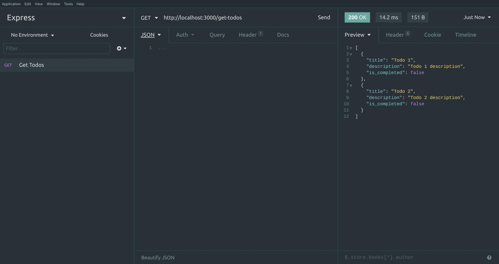

# Asynchronous Programming

## Table of Contents

| No. | Topic                                           |
| :-: | ----------------------------------------------- |
|  1  | [What is API?](#what-is-api)                    |
|  2  | [Express](#express.js)                          |
|  3  | [CORS](#cors) |

# What is API?

Let's talk about your smartphone. Your smartphone has touch screen. You touch the screen to communicate with your device. You swipe left and right, up and down and the application in your smartphone changes according to your touches. So basically, your smartphone's screen is an interface between you and the application. Now this whole experience can be simplified into Application Human Interface as it requires human to communicate with the interface. Now if we take the human away and replace it with the programming or the AI, this whole experience will become Application Programming Interface or simply API.

For example, Twitter is an application. Twitter has an interface (endpoints) so that we can easily interact with Twitter from our application. It exposes a bunch of endpoints that we can call. Hence, this whole thing can be simplified into API.

# Why do we need API?

# What is the purpose of API?

# API Requests

# Express.js

[Express.js](https://expressjs.com/) is a simple node.js framework that can create APIs.

First initialize an empty npm project

```
npm init
```

Then create empty index.js file and install express using npm

```
npm install express --save
```

Now go inside `index.js` and import express

```
// Imports the framework
const express = require("express");
// Creates an instance
const app = express()
```

Let's make a GET route so our frontend can call to get todos

```js
app.get("/get-todos", (req, res) => {
  const todos = {
    todos: [
      {
        title: "Todo 1",
        description: "Todo 1 description",
        is_completed: false,
      },
      {
        title: "Todo 2",
        description: "Todo 2 description",
        is_completed: false,
      },
    ],
  };
  res.json(todos);
});
```

When we call this route `/get-todos` route. It will return the todos in JSON format.

Now let's add a code so our server can listen and serve the clients.

```js
// Listen on this port
app.listen(3000, () => {
  console.log("App is now listening on Port 3000");
});
```

Let's fire up our server by running `index.js`.

```
node index.js
```

And your server should be up and ready to serve.

Do note that when you run the command above the process is always running until you manually stop it. The server job is to run 24/7 and serve requests from the client. To stop it, hit CTRL + C.

Download insomnia [here](https://insomnia.rest/) and test your API.


Next step is to create a Frontend application that can call our API we just created.

[Express.js Docs](http://expressjs.com/)

# CORS

Before we create frontend application. Let's talk about Cross-Origin Resource Sharing or commonly known as CORS.

Domains/Origins are something like this (https://google.com). This is a domain where Google search engine is hosted. Similarly, let's say our API is hosted at this domain called `https://domain-api.com` and our frontend is hosted at `https://domain-frontend.com`. The request from our frontend to backend would be rejected for security reasons because they are not on the same domain. And the term CORS (Cross-Origin Resource Sharing) comes in. But when you host Frontend and Backend at the same domain. You wouldn't bother with CORS.

From MDN

> For security reasons, browsers restrict cross-origin HTTP requests initiated from scripts. For example, XMLHttpRequest and the Fetch API follow the same-origin policy. This means that a web application using those APIs can only request resources from the same origin the application was loaded from unless the response from other origins includes the right CORS headers.

Read more [here](https://developer.mozilla.org/en-US/docs/Web/HTTP/CORS)

### So how do I opt out from this type of restriction?

Well, firstly this is a good thing because it is automatically preventing unknown requests from different domains. If we didn't have this type of restriction anybody can call your API and it isn't good if your API can be called by anyone.

To get rid of this restriction, we can setup a middleware called cors in our API.

Let's install this package

```
npm install cors --save
```

Then import the package

```
const cors = require('cors')
```

Then we have to tell our express instance that we want to use this package.

```
app.use(cors())
```

This will allow all domains. Normally you don't want to allow request from all domain as it exposes a security risk. You only allow request from the domains you trust.

You can restrict access only to certain domains like this

```
var corsOptions = {
  origin: ["http://localhost:5500", "http://127.0.0.1:5500"], // You can add more as needed.
  optionsSuccessStatus: 200, // some legacy browsers (IE11, various SmartTVs) choke on 204
};
app.use(cors(corsOptions))
```

Any requests from different domains except `http://localhost:5500` & `http://127.0.0.1:5500` will be rejected.

Read more about cors package [here](https://www.npmjs.com/package/cors).

[Let's talk about cors (Highly recommended)](https://medium.com/bigcommerce-developer-blog/lets-talk-about-cors-84800c726919)

# Creating a Frontend App

Now let's create a simple index.html file and paste the code below. Change the code below to your liking.

```html
<!DOCTYPE html>
<html lang="en">
  <head>
    <meta charset="UTF-8" />
    <meta http-equiv="X-UA-Compatible" content="IE=edge" />
    <meta name="viewport" content="width=device-width, initial-scale=1.0" />
    <title>Document</title>
    <style>
      * {
        margin: 0;
      }
      html,
      body {
        width: 100%;
        height: 100%;
        font-family: monospace;
        font-weight: 700;
        overflow-x: hidden;
        background: #0b486b; /* fallback for old browsers */
        background: linear-gradient(to left, #f56217, #0b486b);
      }
      #app {
        width: 100%;
        height: 100%;
        color: #cdcdcd;
        margin: 10px;
      }
      .todo {
        text-align: center;
        margin-bottom: 30px;
      }
      .todo p:nth-child(2) {
        text-decoration: underline;
      }
      .todo p:nth-child(1) {
        font-size: large;
      }
    </style>
  </head>
  <body>
    <div id="app"></div>

    <script>
      fetch("http://localhost:3000/get-todos")
        .then((data) => data.json())
        .then((json) => {
          let todos = json.todos;
          let app = document.getElementById("app");

          for (let i = 0; i < todos.length; i++) {
            let todo = todos[i];
            let template = `
                <div class="todo">
                    <p>${todo.title}</p>
                    <p>${todo.description}</p>
                </div>
                `;
            app.innerHTML += template;
          }
        });
    </script>
  </body>
</html>
```

Now run your index.html file with [Live Server](https://marketplace.visualstudio.com/items?itemName=ritwickdey.LiveServer) by right clicking on it.

Don't forget to start your server.

```
node index.js
```

And there we go! We can see our todos displayed right on the screen and it's coming directly from our server.

### Congrats! You just made a full stack application!

Try taking out this line `app.use(cors(corsOptions))` from `index.js`. What do you get as a response? Open your console to find out!
