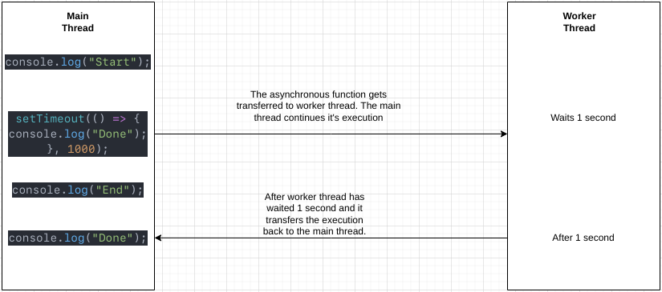

# Asynchronous Programming

## Table of Contents

| No. | Topic                                           |
| :-: | ----------------------------------------------- |
|  1  | [What is Asynchronous?](#what-is-asynchronous)  |
|  2  | [Threads](#threads)                             |
|  3  | [Asynchronous Code](#asynchronous-code-example) |

# What is Asynchronous?

Javascript is executed from top to bottom. Simple. You type in lines of code. Each line is read and executed. However, this may become an issue if the codebase is huge and it must wait for previous code to complete before running new code. The execution will be slow. This is an unpleasant experience that wastes computer processing power, especially in an era when computers have several processor cores. Why not take advantage of other cores? Welcome to **asynchronous programming**.

# Threads

A thread is basically a single process that a program can use to complete tasks. Each thread can only do a single task at once:

```
Task A --> Task B --> Task C
```

A previous task has to complete before running next task.

In modern era, processors have multiple cores. So we can do multiple things at once. There are programming languages that can support multiple threads to run tasks simultaneously. For example, Java.

However, JavaScript is a single-threaded. [Read more here](https://developer.mozilla.org/en-US/docs/Learn/JavaScript/Asynchronous/Concepts#javascript_is_single-threaded).

In short, after a while. Javascript has managed to developed a new API called [Web workers](https://developer.mozilla.org/en-US/docs/Web/API/Web_Workers_API). The [Web workers](https://developer.mozilla.org/en-US/docs/Web/API/Web_Workers_API) basically allows you to send a task to a separate thread.

# Asynchronous Code Example

Let's start with synchronous code first. When we read Javascript, we tend to read from top to bottom. Because this is how we human read. But computers don't always read from top to bottom. They can skip some part and come back to them later.

Take a look at the synchronous code below.

```
console.log("Start");
function getUser() {
  let i = 0;
  while (i < 1000000000) {
    i++;
  }

  const data = {
    name: "User 1",
    id: 1,
  };

  return data;
}

const user = getUser();
console.log(user);
console.log("End");
```

Try to run this. It will output

```
Start
{ name: 'User 1', id: 1 }
End
```

The execution took a while as you can see because we're running a loop one billion times. And since it's running on single thread, it waits for the loop to finish before displaying "End".

Now let's try running the code below.

```
console.log("Start");
setTimeout(() => {
  console.log("Done");
}, 1000);
console.log("End");
```

You'd expect it to output like this right?

```
Start
// waits one second
Done
End
```

Let's run this and this is what we get.

```
Start
End
// waits one second
Done
```

What is going on here? Why "End" is displayed first even though it comes after the `setTimeout`.

Also, do keep in mind JavaScript is single-threaded. Meaning that it has one main thread. So everything is executed from this main thread.

To answer the question, let's simplify the execution of the code. When we run the code. The first thing it will do is to log "Start". Then it goes to `setTimeout` function and `setTimeout` is an asynchronous code so it gets transfered to the web worker thread. The worker thread process the request and waits for one second. However on the main thread, the execution continues. That's why "End" is being logged before the "Done". Now once the timeout is passed, the worker thread transfers the code back to the main thread. The main thread continues, and finally "Done" is logged.

Take a look at this diagram.



# Callback function

What is a callback? Basically a function that takes another function is considered callback. Believe it or not, the code we just tried is callback function.

```
console.log("Start");
setTimeout(() => {
  console.log("Done");
}, 1000);
console.log("End");
```

Why is this callback function? If you take a look at the syntax very carefully, setTimeout is actually a function.

```
setTimeout()
```

We also passed in another function in the setTimeout function's first parameter and timeout in the second parameter.

When we run this code, first thing it's gonna do is process the setTimeout function then invokes the the outer function (passed in as parameter) to complete some kind of routine or action.

You can think of a callback function as two functions executed one after another. It executes first function then callback/executes another function.

So how can we create a callback function?

```
function getTodos(callback) {
  let i = 0;
  while (i < 1000000000) {
    i++;
  }
  let todos = ["Todo 1", "Todo 2", "Todo 3", "hello"];
  callback(todos);
}
```

Take a look the code above. The function last line `callback(todos);` is to invoke another function from the parameter.

When calling this function, we can pass another function in the parameter and it will be processed as well. Notice that execution is synchronous as it's invoked immediately after processing the main function.

Try calling this code below.

```
getTodos((todos) => {
  console.log(todos)
});
```

You will get output like this.

```
[ 'Todo 1', 'Todo 2', 'Todo 3', 'hello' ]
```

### Callback Hell

When you put a function inside another function parameter. It becomes callback. Quite simple but imagine this scenario. What if there is another callback inside a callback?

Take a look at our initial code.

```
function getTodos(callback) {
  let i = 0;
  while (i < 1000000000) {
    i++;
  }
  let todos = ["Todo 1", "Todo 2", "Todo 3", "hello"];
  callback(todos);
}
```

```
getTodos((todos) => {
  console.log(todos)
});
```

Now let's add one more callback. Here's what we're trying to do.  
1 - Get all todos  
2 - Process those todos & remove profanity  
3 - Display todos

```
function getTodos(callback) {
  let i = 0;
  while (i < 1000000000) {
    i++;
  }
  let todos = ["Todo 1", "Todo 2", "Todo 3", "bad word"];
  callback(todos);
}

function processTodo(todos, callback) {
  let badWords = ["bad word"];
  for (let i = 0; i < todos.length; i++) {
    if (badWords.includes(todos[i])) {
      todos.splice(i, 1);
    }
  }
  callback(todos);
}
```

Now let's call these.

```
getTodos((todos) => {
  processTodo(todos, (filteredTodos) => {
    console.log(filteredTodos);
  });
});
```

The output

```
[ 'Todo 1', 'Todo 2', 'Todo 3' ] // Profanity removed
```

We successfully completed our steps. First we call a function that returns the todos then we call another function to remove profanity. Finally we display them. But there is a problem with this code.What would your code look like if there is a lot of callback after callback? Welcome to callback hell.

Take a look these callbacks.
```
fs.readdir(source, function (err, files) {
  if (err) {
    console.log('Error finding files: ' + err)
  } else {
    files.forEach(function (filename, fileIndex) {
      console.log(filename)
      gm(source + filename).size(function (err, values) {
        if (err) {
          console.log('Error identifying file size: ' + err)
        } else {
          console.log(filename + ' : ' + values)
          aspect = (values.width / values.height)
          widths.forEach(function (width, widthIndex) {
            height = Math.round(width / aspect)
            console.log('resizing ' + filename + 'to ' + height + 'x' + height)
            this.resize(width, height).write(dest + 'w' + width + '_' + filename, function(err) {
              if (err) console.log('Error writing file: ' + err)
            })
          }.bind(this))
        }
      })
    })
  }
})
```

No human can understand this. To fix this problem, let's take a look at [Promises](https://developer.mozilla.org/en-US/docs/Web/JavaScript/Reference/Global_Objects/Promise).
