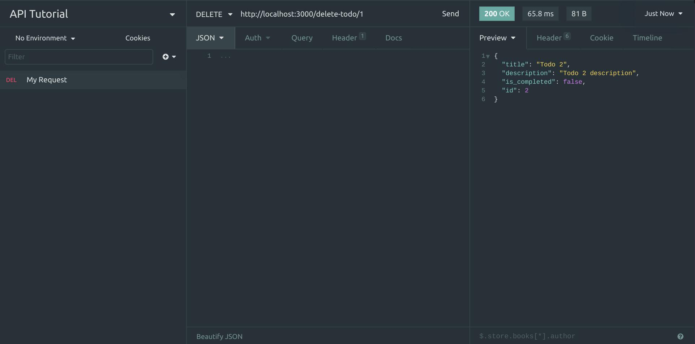

# API - Application Programming Interface

## Table of Contents

| No. | Topic                                                                   |
| :-: | ----------------------------------------------------------------------- |
|  1  | [What is API?](#what-is-api?)                                           |
|  2  | [Why do we need API?](#why-do-we-need-api?)                             |
|  3  | [HTTP Methods](#http-methods)                                           |
|  4  | [Difference between Server and API](#difference-between-server-and-api) |
|  5  | [Example Applicaton](#example-application)                              |
|  5  | [Insomnia or Postman](#insomnia-or-postman)                             |
|  6  | [Express](#express-js)                                                  |
|  7  | [CORS](#cors)                                                           |
|  8  | [Frontend App](#frontend-app)                                           |

# What is API?

Let's talk about your smartphone. Your smartphone has touch screen. You touch the screen to communicate with your device. You swipe left and right, up and down and the application in your smartphone changes according to your touches. So basically, your smartphone's screen is an interface between you and the application. Now this whole experience can be simplified into Application Human Interface as it requires human to communicate with the interface. Now if we take the human away and replace it with the programming or the AI, this whole experience will become Application Programming Interface or simply API.

For example, Twitter is an application. Twitter has an interface (endpoints) so that we can easily interact with Twitter from our application. It exposes a bunch of endpoints that we can call. Hence, this whole thing can be simplified into API.

# Why do we need API?

Say you're in a restaurant, you want to eat some good food. You talk to the waiter to order a dish. Your waiter orders and bring the food out from the kitchen. Your waiter is a bridge between you (the customer) and the kitchen (the database). The customer cannot simply go to the kitchen and order food there. It doesn't work like that.

Now let's translate the topic above into the code. Since the customer is a client, the customer can be a front-end application. Since the kitchen stores all the food, the kitchen can be a database. Since the waiter talks to both customer and the kitchen, the waiter can be an API. Now you get where I am going with this? The front-end cannot simply talk to the database. We need a bridge (API) that communicates with a database and a front-end application.

Your front-end application could have a login form. Users can log in by entering their username and password in this form. To successfully log the user in, you need to verify their username and password match the username and password in the database. But your front-end cannot simply get the username and password from the database as it would expose security risks. An API is needed to communicate with the database and the front-end.

# HTTP Methods

HTTP Methods are a way of telling the server what type of requests we are making. The most common requests are

- `GET` (This method is used to retrieve information from the server. For Example - Getting user information, user's photos, etc)
- `POST` (This method is used to send data to the server. Example - Registering a user and storing the information in the database)
- `PUT` (This method is used to update the existing data in the server. Example - Updating user's DOB, Name, Avatar, etc)
- `DELETE` (This method is used to delete the data from the server. for Example - Deleting a user's account)

# Difference between Server and API

So far, you'd come to realize that we have been using the terms API and Server without actually knowing the difference between them. An API isn't the same as a server. A server is a machine running some process that executes some service for you. API is a service in the server. When you send a `GET` request to the server, the server will find an API for this type of request. When found, it will then transfer the request to the API. API will respond something back to the client.

Let's take a look at this example request - `https://jsonplaceholder.typicode.com/users`

The server part is `https://jsonplaceholder.typicode.com`, and the API part is `/users`. When you open this URL in your browser, it will return you a list of users. That's because `/users` API exists on the server. If you try any API that doesn't exist, such as `https://jsonplaceholder.typicode.com/users-2`, it will return you nothing. Open your console, you will see this error

```
GET https://jsonplaceholder.typicode.com/users-2 404
```

`404` means not found in HTTP terms. The server couldn't find an API called /users-2. Read more about HTTP status codes [here](https://en.wikipedia.org/wiki/List_of_HTTP_status_codes).

API needs a server to live. But a server doesn't. Try opening this [link](https://www.youtube.com/watch?v=dQw4w9WgXcQ) in your browser. Technically, you're trying to watch a video from the youtube server. The server will try to find the `/watch` API first. If found, it will find a video with this id `v=dQw4w9WgXcQ`. Once again, API needs a server to live. But a server doesn't.

Also, API is sometimes called a route/endpoint. API is usually a defined term, endpoint or route are a physical representation.

# Example Application

We'll be building simple to-do application to get to know API and HTTP methods better. Here's the breakdown of our application.

- Our server stores all todos. We don't have a database yet. So we store todos in the array format in the server.
- Our server will have 4 routes.
  - `GET` route to retrieve the todos.
  - `POST` route to add a new todo.
  - `PUT` route to update existing todo.
  - `DELETE` route to delete todos.
- A frontend application that can interact with our APIs.
- We'll be using [Express.js](https://expressjs.com/) to create APIs

# Insomnia or Postman

We always need to test our APIs. To make bug-free APIs, you need to test your APIs a lot. Of course, We can easily create a front-end application to test out our APIs, but it's time-consuming and double work. API clients are created just for this. It makes it easy for developers like you to create, share, test, and document APIs without needing to create a front-end application. You can pretty much test any method, such as GET, POST, PUT, and DELETE. The best part is it has GUI. So the result will be much more efficient and less tedious work.

There are many API clients, but the most popular ones are Postman and Insomnia. For this session, I'll be using Insomnia as my API client. Feel free to use your own.

Download Insomnia [here](https://insomnia.rest/products/insomnia) and Postman [here](https://www.postman.com/).

# Express JS

[Express.js Docs](http://expressjs.com/)

Let's get to work! [Express.js](https://expressjs.com/) is a simple node.js framework that can create APIs.

First, create a empty folder and initialize new npm project inside newly created folder.

```
npm init -y
```

Then create empty `index.js` file and install express using npm.

```
npm install express --save
```

Now go inside `index.js` and import express.

```js
// Imports the framework
const express = require("express");
// Creates an instance
const app = express();
// Allow incoming request object as a JSON Oject.
app.use(express.json());
// Mock database
const todos = [
  {
    title: "Todo 1",
    description: "Todo 1 description",
    is_completed: false,
    id: 1,
  },
  {
    title: "Todo 2",
    description: "Todo 2 description",
    is_completed: false,
    id: 2,
  },
];
```

Now let's add a code so our server can listen and serve the clients.

```js
// Listen for requests on this port
app.listen(3000, () => {
  console.log("App is now listening on Port 3000");
});
```

Let's fire up our server by running `index.js`.

```
node index.js
```

_Do note that when you run the command above, the process keeps on running until you manually stop it. The server job is to run 24/7 and serve requests from the client. To stop, hit CTRL + C_.

Our server is running at http://localhost:3000/. Try sending a GET request in Insomnia. You will get a 404 not found error.


And that's expected because even though our server is up, we haven't created any APIs yet. Let's create some APIs.

### Making a GET route so our client can retrieve todos.

```js
app.get("/get-todos", (req, res) => {
  // Respond in JSON format
  res.json(todos);
});

// Listen for requests on this port
app.listen(3000, () => {
  console.log("App is now listening on Port 3000");
});
```

**Heads up**. We have to stop the server and run it again to reflect the changes. Hit CTRL + C, and run the command `node index.js` again. You will need to do this every time you make a change to your server. It can become a bit annoying. We'll install nodemon, a useful npm tool that automatically restarts the server when it detects a change.

```
npm install -g nodemon
```

`-g` means global. Install this tool globally so that we can use it across our projects.

Once we have nodemon installed, let's stop the server (CTRL + C) and run with again with the command below.

```
nodemon index.js
```

From now on, the server will automatically restart every time we make a change to it.

Moving on, try sending a GET request to this route (http://localhost:3000/get-todos) in Insomnia. You will see the server responds with the todos. Congrats! You just made an API.


So far, this is what we have in our `index.js`.

```js
// Imports the framework
const express = require("express");
// Creates an instance
const app = express();
// Allow incoming request object as a JSON Oject.
app.use(express.json());
// Mock database
const todos = [
  {
    title: "Todo 1",
    description: "Todo 1 description",
    is_completed: false,
    id: 1,
  },
  {
    title: "Todo 2",
    description: "Todo 2 description",
    is_completed: false,
    id: 2,
  },
];

app.get("/get-todos", (req, res) => {
  // Respond in JSON format
  res.json(todos);
});

// Listen for requests on this port
app.listen(3000, () => {
  console.log("App is now listening on Port 3000");
});
```

Let's add some more routes.

### Making a POST route to add new todo.

```js
app.post("/create-todo", (req, res) => {
  const todo = {
    title: req.body.title,
    description: req.body.description,
    is_completed: false,
    // Generates a random integer from 1 to 1000.
    id: Math.floor(Math.random() * 1000) + 1,
  };
  // Push to the end of the array
  todos.push(todo);
  res.json(todo);
});
```

To add new todo, client have to pass title, description in the request body as JSON Object.

Let's add a new todo. We'll send a POST request to this route (http://localhost:3000/create-todo) in Insomnia. It should return 200.


Now, try sending a GET request to this route (http://localhost:3000/get-todos) in Insomnia. There should be a new todo.

### Making a PUT route to update existing todo.

```js
app.put("/update-todo/:id", (req, res) => {
  const id = req.params.id;
  // Find the index of the todo that's being updated.
  const index = todos.findIndex((todo) => todo.id == id);

  // If found, update it
  if (index >= 0) {
    todos[index].title = req.body.title;
    todos[index].description = req.body.description;
    todos[index].is_completed = req.body.is_completed;
    res.send(todos[index]);
  } else {
    // Not found, respond with error
    res.status(400).send("Todo not found.");
  }
});
```

To update existing todo, call this route with the ID of todo that you want to update. For example - If you want to update todo with an id of 1, send the PUT request to this route `/update-todo/1`.

Let's update a todo with an id of 2. We'll send a PUT request to this route (http://localhost:3000/update-todo/2) in Insomnia. It should return 200.


Now, try sending a GET request to this route (http://localhost:3000/get-todos) in Insomnia. The todo with an id of 2 should be updated.

### Making a DELETE route to delete todo.

```js
app.delete("/delete-todo/:id", (req, res) => {
  const id = req.params.id;
  // Find the index of the todo that's being deleted.
  const index = todos.findIndex((todo) => todo.id == id);

  // If found, delete it
  if (index >= 0) {
    todos.splice(index, 1);
    res.json(todos[index]);
  } else {
    // Not found, respond with error
    res.status(400).send("Todo not found.");
  }
});
```

To delete a todo, call this route with the ID of todo that you want to delete. For example - If you want to delete todo with an id of 1, send the PUT request to this route `/delete-todo/1`.

Let's delete a todo with an id of 1. We'll send a DELETE request to this route (http://localhost:3000/delete-todo/1) in Insomnia. It should return 200.



Now, try sending a GET request to this route (http://localhost:3000/get-todos) in Insomnia. The todo with an id of 1 should be deleted.

Great! Our server now fully supports CRUD. Meaning, the server can create, read, update, and delete. Read more about CRUD [here](https://en.wikipedia.org/wiki/Create,_read,_update_and_delete).

### _Congrats! You just made a server._

Next step is to create a Frontend application that can communicate with our server.

# CORS

Before we create frontend application. Let's talk about Cross-Origin Resource Sharing or commonly known as CORS.

Domains/Origins are something like this (https://google.com). This is a domain where Google search engine is hosted. Similarly, let's say our server is hosted at this domain called `https://domain-api.com` and our frontend is hosted at `https://domain-frontend.com`. API calls from the frontend to the server would be rejected because they are are not on the same domain/origin. Solution is to enable CORS(Cross-Origin Resource Sharing).

From MDN

> For security reasons, browsers restrict cross-origin HTTP requests initiated from scripts. For example, XMLHttpRequest and the Fetch API follow the same-origin policy. This means that a web application using those APIs can only request resources from the same origin the application was loaded from unless the response from other origins includes the right CORS headers.

Read more [here](https://developer.mozilla.org/en-US/docs/Web/HTTP/CORS)

### So how do I opt out from this type of restriction?

Well, firstly this is a good thing because it is automatically preventing unknown requests from different domains. If we didn't have this type of restriction anybody can call your API.

To get rid of this restriction, we can setup a middleware called cors in our APIs.

Let's install this package

```
npm install cors --save
```

Then import the package

```js
// Imports cors package
const cors = require("cors");
// Creates an instance
const app = express();
```

Then we have to tell our express instance that we want to use this package.

```js
// Allow CORS
app.use(cors());
// Allow incoming request object as a JSON Oject.
app.use(express.json());
```

This will allow all domains. Normally you don't want to allow request from all domain as it exposes a security risk. You only allow request from the domains you trust.

You can restrict access only to certain domains like this

```js
var corsOptions = {
  origin: ["http://localhost:8080", "http://127.0.0.1:8080"], // You can add more as needed.
  optionsSuccessStatus: 200, // some legacy browsers (IE11, various SmartTVs) choke on 204
};
// Allow CORS
app.use(cors(corsOptions));
```

Any requests from different domains except `http://localhost:8080` & `http://127.0.0.1:8080` will be rejected.

Read more about cors package [here](https://www.npmjs.com/package/cors).

[Let's talk about cors (Highly recommended)](https://medium.com/bigcommerce-developer-blog/lets-talk-about-cors-84800c726919)

# Frontend App

[Here](/codes/todo-mvc) is the frontend app that talks to our server directly. Go ahead and run the app. Don't forget to start the server.

```
nodemon index.js
```

And there we go! We can see our todos displayed right on the screen and it's coming directly from our server. You can create, edit, delete and update todos and it will be saved on the server.

### Congrats! You just made a full stack application!

Try taking out this line `app.use(cors(corsOptions))` from `index.js`. Don't forget to restart your server. What do you get as a response? Open your console to find out!

<!-- # Creating a Frontend App

Now let's create a simple index.html file and paste the code below. Change the code below to your liking.

```html
<!DOCTYPE html>
<html lang="en">
  <head>
    <meta charset="UTF-8" />
    <meta http-equiv="X-UA-Compatible" content="IE=edge" />
    <meta name="viewport" content="width=device-width, initial-scale=1.0" />
    <title>Document</title>
    <style>
      * {
        margin: 0;
      }
      html,
      body {
        width: 100%;
        height: 100%;
        font-family: monospace;
        font-weight: 700;
        overflow-x: hidden;
        background: #0b486b; /* fallback for old browsers */
        background: linear-gradient(to left, #f56217, #0b486b);
      }
      #app {
        width: 100%;
        height: 100%;
        color: #cdcdcd;
        margin: 10px;
      }
      .todo {
        text-align: center;
        margin-bottom: 30px;
      }
      .todo p:nth-child(2) {
        text-decoration: underline;
      }
      .todo p:nth-child(1) {
        font-size: large;
      }
    </style>
  </head>
  <body>
    <div id="app"></div>

    <script>
      fetch("http://localhost:3000/get-todos")
        .then((data) => data.json())
        .then((json) => {
          let todos = json.todos;
          let app = document.getElementById("app");

          for (let i = 0; i < todos.length; i++) {
            let todo = todos[i];
            let template = `
                <div class="todo">
                    <p>${todo.title}</p>
                    <p>${todo.description}</p>
                </div>
                `;
            app.innerHTML += template;
          }
        });
    </script>
  </body>
</html>
```

Now run your index.html file with [Live Server](https://marketplace.visualstudio.com/items?itemName=ritwickdey.LiveServer) by right clicking on it.

Don't forget to start your server.

```
node index.js
```

And there we go! We can see our todos displayed right on the screen and it's coming directly from our server.

### Congrats! You just made a full stack application!

Try taking out this line `app.use(cors(corsOptions))` from `index.js`. Don't forget to restart your server. What do you get as a response? Open your console to find out! -->
