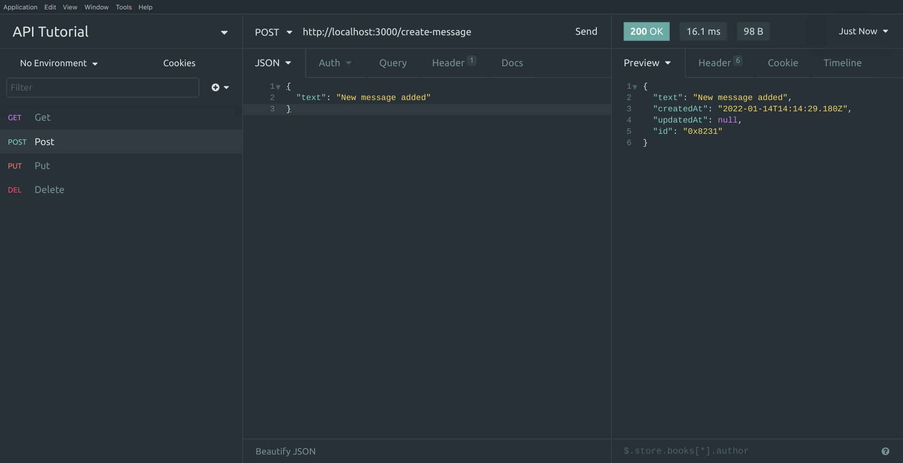

# API Challenges

## Table of Contents

| No. | Topic                                                           |
| :-: | --------------------------------------------------------------- |
|  1  | [Chat Application Backend](#chat-application-backend)   |
|  1  | [Chat Application Frontend](#chat-application-frontend) |

Before you attempt this challenge. Please make sure you have

1. Node js installed.
2. Solid JavaScript background.
3. A basic understanding of APIs and Express JS.
4. Insomnia/Postman installed.

# Chat Application Backend

Challenge - Create a backend for a chat application

Your server must support CRUD (Create, Read, Update, Delete) operation for your frontend application.

Here is the starter code. [Starter code](chat-application-backend-starter)

## Routes

1. Have a route that can return messages.
2. Have a route that can add new message.
3. (Optional) Have a route that can update existing message by ID.
4. Have a route that can delete a message by ID.

## Schema

Here is an example of a message

```js
{
    "text": "Hello world",
    "id": "0x123456", // Must be unique
    "createdAt": "2022-01-14T13:27:59.913Z",
    "updatedAt": "2022-01-14T13:27:59.913Z" // When a message is updated, this field is updated as well
}
```

1. There should be a unique ID for each messages and the id has to be generated on th server. There shouldn't be any duplicated messages with the same ID.
2. There should be a created at field for each messages.
3. There should be a updated at field for each messages. When a message is updated, this field should be updated.

## Testing your server

You can use insomnia/postman to test your routes. Request should pass the tests below.

- ### Getting the messages

  

- ### Creating a message

  

- ### Updating a message

  

- ### Updating a message (Not found)

  

- ### Deleting a message

  

- ### Deleting a message (Not found)
  

## Submitting

Once you're done with this challenge. Create a Github repository and push your code. Then submit your repository link [here](https://pathforge.co/adventures/1/Complete-Software-Development-Programme/journeys/359/challenges/794).

# Chat Application Frontend
Challenge - Create a frontend for a chat application

The frontend application must use the backend server and supports sending, reading, updating and deleting messages.

Here is the starter code. [Starter code](chat-application-frontend-starter)

## Feature List
- [x] App must use Vue as a framework.
- [ ] App must be properly styled.
- [ ] Support reading messages from the API you previously created. Use either Fetch API or Axios to fetch the data.
- [ ] Support sending a message.
- [ ] Support updating a message. (Optional)
- [ ] Support deleting a message.
- [ ] Bonus - Support deleting messages in batch.

## Submitting

Once you're done with this challenge. Create a Github repository and push your code. Then submit your repository link [here](https://pathforge.co/adventures/1/Complete-Software-Development-Programme/journeys/359/challenges/795).